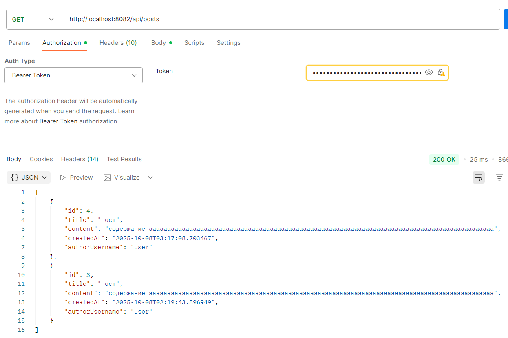

# Работа 1: Разработка защищенного REST API с интеграцией в CI/CD

## Описание проекта
Spring Boot приложение для демонстрации безопасной разработки.  
Реализовано REST API с аутентификацией по JWT и защитой от распространённых уязвимостей.

## API эндпоинты
### 1. POST /api/auth/register - Регистрация нового пользователя


### 2. POST /api/auth/login - Аутентификация и выдача JWT


### 3. GET /api/posts - Получить список постов


### 4. POST /api/posts - Добавить пост

---

## Реализованные меры безопасности

### 1. Аутентификация и авторизация
- Используется Spring Security + JWT.
- Каждый запрос к защищённым ресурсам требует заголовка `Authorization: Bearer <token>`.
- Токен подписан секретом из `application.properties`


### 2. Защита от SQL-инъекций
- Используется Spring Data JPA, что исключает использование небезопасных SQL-строк.
- Все запросы выполняются через PreparedStatement внутри JPA.

### 3. Защита от XSS
- Валидация входных данных через @Valid и @Size, @Pattern.
- Spring автоматически HTML-экранирует вывод (@RestController → JSON, не HTML).

### 4. OWASP рекомендации
- Используется spring-boot-starter-validation для валидации данных.
- Пароли хэшируются через BCryptPasswordEncoder.
- Конфигурация SecurityFilterChain запрещает доступ без токена к приватным эндпоинтам.

## Отчет SAST


### 1. Критическая уязвимость: Использование дефолтной кодировки в JWTUtils (Исправила явным указанием кодировки)
```java
jwtSecret.getBytes(StandardCharsets.UTF_8);
```

### 2. Утечка внутреннего представления в классе Post (Исправила созданием копии)

```java
private User createDefensiveCopy(User original) {
    User copy = new User();
    copy.setUsername(original.getUsername());
    return copy;
}
```
### 3. Мертвый код в AuthController (Исправила удалением неиспользуемого объекта)


## Отчет SCA


